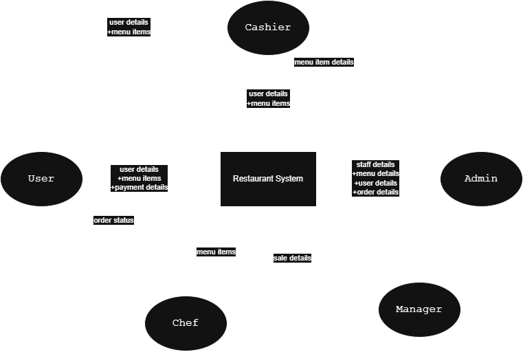
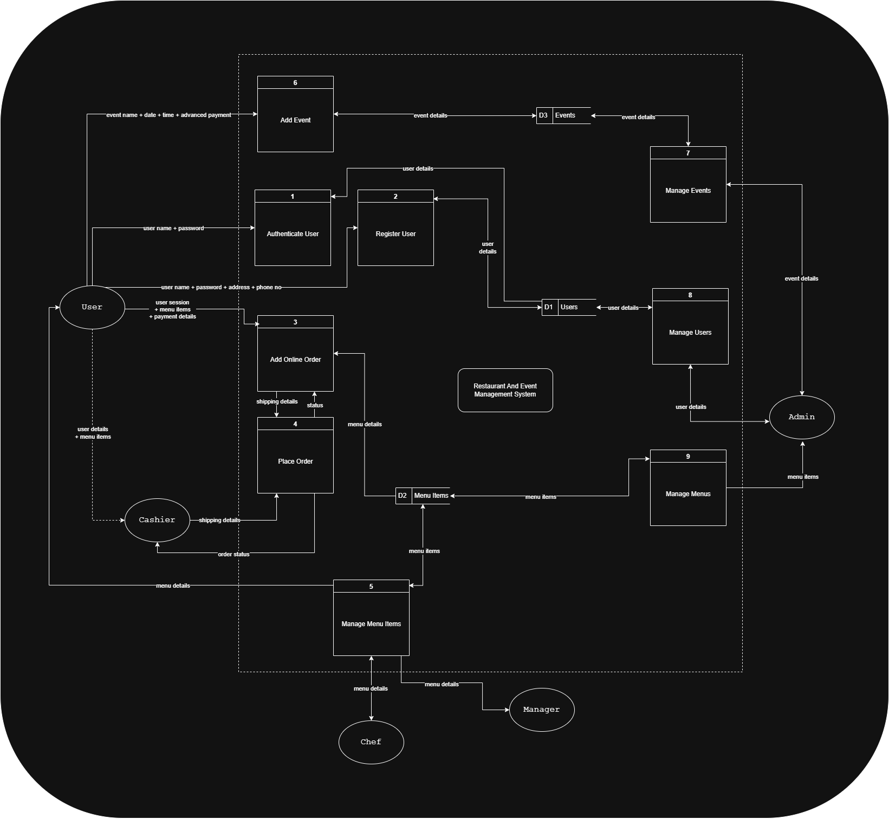

# 📘 Servizio – Project Documentation

> **“Serving experiences. Seamlessly.”**  
> A modern restaurant and event management system built for efficiency, elegance, and scalability.

---

## 📍 Table of Contents

1. [📌 Project Summary](#-project-summary)
2. [🔍 Research & Motivation](#-research--motivation)
3. [🧭 SDLC Phases](#-sdlc-phases)
4. [📐 System Design](#-system-design)
5. [🛠️ Tech Stack & Architecture](#-tech-stack--architecture)
6. [🎨 UI/UX & Screenshots](#-uiux--screenshots)
7. [🧪 Testing & QA](#-testing--qa)
8. [📈 Results & Metrics](#-results--metrics)
9. [📦 Future Enhancements](#-future-enhancements)
10. [📚 References](#-references)

---

## 📌 Project Summary

**Servizio** is a full-stack web platform that simplifies **restaurant table reservations** and **event planning** into one clean interface. The system handles scheduling, menus, customer tracking, staff assignments, and automated notifications, offering a seamless experience for both managers and customers.

---

## 🔍 Research & Motivation

**Problems Identified:**

- Fragmented systems for restaurant reservations and event management.
- Manual errors in double-booking tables or event slots.
- Poor communication between front-of-house, kitchen, and event hosts.

**Goals:**

- Combine restaurant and event workflows.
- Create a highly usable UI for non-tech users (chefs, waiters, hosts).
- Ensure real-time synchronization and prevent booking conflicts.

---

## 🧭 SDLC Phases

| Phase                       | Description                                                            |
| --------------------------- | ---------------------------------------------------------------------- |
| 🔍 **Requirement Analysis** | Stakeholder interviews, competitive analysis (OpenTable, Eventbrite)   |
| 🧠 **Planning**             | Use case diagrams, feature prioritization with MoSCoW method           |
| 🛠️ **Design**               | Created system architecture, ERD, DFDs, and low-fidelity UI wireframes |
| 🧑‍💻 **Implementation**       | Agile sprints using Git & Trello, weekly progress reviews              |
| 🧪 **Testing**              | Unit, integration, and manual user testing with a QA checklist         |
| 🚀 **Deployment**           | Local deployment (Docker), optional cloud deployment with Firebase     |
| 📈 **Maintenance**          | Logging, error reporting, feature planning via GitHub Issues           |

---

## 📐 System Design

### 🧩 High Level Diagram



### 📊 Data Flow Diagram (Level 1)



### 🗂️ ER Diagram (Sample)

- `User(user_id, role, name, email)`
- `Reservation(reservation_id, user_id, table_id, date_time)`
- `Event(event_id, organizer_id, title, date_time)`
- `MenuItem(item_id, name, price, category)`
- Relationships:

  - One-to-many: `User -> Reservations`, `Event -> Staff`

---

## 🛠️ Tech Stack & Architecture

### 🧱 Architecture

```
Frontend (React.js + Tailwind)
        ⬇
REST API (Spring Boot or Express.js)
        ⬇
Database (MySQL / MongoDB)
        ⬇
Auth Layer (JWT)
```

### ⚙️ Technologies Used

| Layer    | Tools/Libraries                          |
| -------- | ---------------------------------------- |
| Frontend | React, Tailwind CSS, Axios, React Router |
| Backend  | Spring Boot, JWT, BCrypt                 |
| Database | MySQL (relational)                       |
| DevOps   | Docker, GitHub Actions (CI), Postman     |

---

## 🎨 UI/UX & Screenshots

> All UI built with minimalism and clarity in mind, optimized for dark/light mode.

| Module              | Description                         | Screenshot                               |
| ------------------- | ----------------------------------- | ---------------------------------------- |
| 🏠 Dashboard        | Overview of bookings, events, stats |  |
| 📅 Reservation View | Calendar-based table booking        |    |
| 🍽️ Menu Editor      | Drag-and-drop dish manager          |            |
| 🎉 Event Planner    | Add, edit, assign staff to events   |          |

---

## 🧪 Testing & QA

- **Unit Testing** – JUnit for backend logic
- **Integration Testing** – Postman & Swagger API tests
- **Manual Testing** – Feature checklist (✓ All features tested manually)
- **Bug Tracking** – GitHub Issues + Labels

---

## 📈 Results & Metrics

| Metric                    | Status               |
| ------------------------- | -------------------- |
| Avg. Booking Time Reduced | ✅ \~40% faster      |
| Double Bookings           | ✅ Eliminated        |
| Mobile Usability Score    | ✅ 90%+ (Lighthouse) |
| App Load Speed            | ✅ <1.5s             |

---

## 📦 Future Enhancements

- [ ] SMS/WhatsApp Integration for customer notifications
- [ ] QR-based self-check-in for events
- [ ] AI-powered menu suggestions based on event type
- [ ] Admin analytics dashboard (heatmap, customer trends)

---

## 📚 References

- OpenTable Developer Docs
- Spring Boot Security Docs
- Apple HIG (Human Interface Guidelines)
- UI inspiration: Notion, Stripe Dashboard, Apple Calendar

---

> Built with care and attention to detail — for businesses that value great service.
> **– Team Servizio**

---
